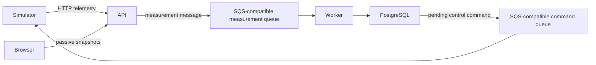

# Architecture and contracts

## Processing paths

`demo/` composes the local browser experience and thermal runtime. `services/` contains ingestion, query, processing and simulator applications. `packages/` holds shared domain, database, configuration and queue code. `migrations/` owns the PostgreSQL schema.

### Shared thermostat and local composition

`packages/thermal/service.py` remains the business authority. The shared HTTP
factory in `packages/thermal/http.py` takes a SQLAlchemy session factory, a validated
`time_multiplier`, and an `observe_runtime` callback. It owns the existing request
models and routes. Constructing the router or reading a snapshot neither creates a
room nor recovers a simulation. Runtime availability is supplied separately from
persisted business state; `unknown` and `unavailable` retain their meaning.

`packages/thermal/runtime.py` owns `RoomClock`, measurement publication, command
publication and command consumption. The monotonic clock remains injectable.
Measurement publication receives a `publish_reading(body, simulation_id)` callback
that returns the actual transport receipt or raises. It sends the exact stored
body and records the receipt in a subsequent transaction. Failed publication or
receipt persistence leaves the reading eligible for retry. Commands use a separate
`CommandTransport` protocol (`publish`, `receive`, `acknowledge`); deliveries retain
their `Body` and `ReceiptHandle` fields. Successful application commits before
acknowledgement, and redelivery cannot repeat a committed effect.

`demo/app.py` assembles the HTTP router and serves the existing static interface.
`demo/thermal_local.py` validates the local multiplier and observes the launcher's
runtime file/PID. `demo/thermal_runtime.py` supplies the HTTPX publication adapter,
local command queue, signals, threads and polling intervals. Startup first commits
recovery of existing simulations, then optionally initializes the shared room,
then starts the engine. Recovery requires explicit resume; HTTP reads stay passive.
The shared modules import no local composition or transport clients and their
package initialization starts no work. AWS adapters and execution remain future work.

The API accepting a measurement establishes receipt/publication evidence, not completion. The worker commits business results in PostgreSQL before acknowledging successful processing to the queue. A failed pre-commit attempt can be redelivered. A committed message can also be delivered again when acknowledgement fails.

## Duplicates and retries

The worker checks the measurement idempotency key before creating another business event. A detected duplicate refers to its original event when the available journal evidence permits that relationship to be shown. This is a deduplication contract, not a general exactly-once guarantee.

The browser retains exact submitted payloads and receipts in its tab cache. An explicit retry resends the preserved body; it does not reconstruct a payload from normalized results. A lost HTTP response leaves the outcome ambiguous. Reloading resumes observation, not submission.

Thermostat setting operations use a UUID `operation_id` and `expected_revision`. Identical retries reuse the operation identity; conflicting reuse or stale state is rejected. Read the saved operation and current snapshot before deciding whether to continue after an uncertain response.

## Evidence and transaction boundaries

Business results and the processing journal have different roles. Journal observations are best effort; missing observations remain unknown. A terminal observation is associated with the business transaction and becomes visible after commit. A journal failure must not fabricate a business failure or trigger a second committed business event.

The UI reads snapshots with measurement, command and operation identities and timestamps. The last command may originate from a different measurement than the latest displayed measurement. The diagram pulses on newly observed evidence; initial or identical snapshots do not create new processing evidence.

Queue counts are approximate aggregate observations. They do not prove that an individual measurement completed. The local queue-observation route reads queue attributes and does not consume messages. Missing counts remain unavailable, and old samples retain their original timestamp.

The database persists during one launcher session. Browser receipts additionally depend on tab storage. Neither survives deletion of the disposable environment as a durable audit system.
